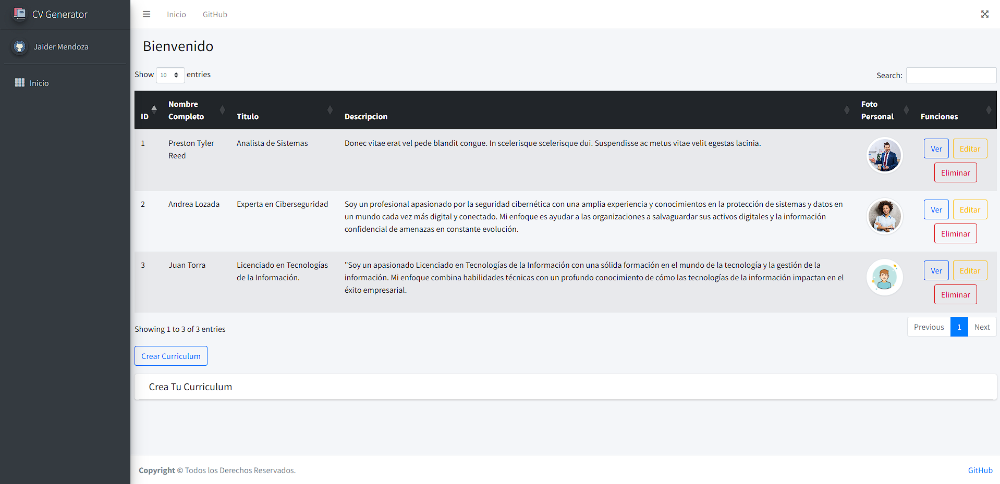
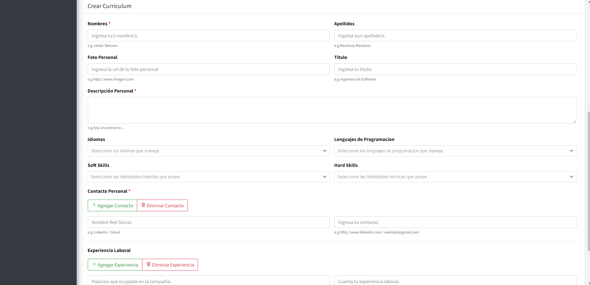
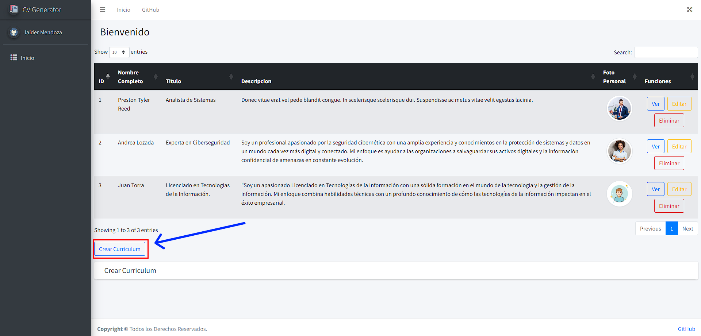

## Autor
- [Jaider Steeven Mendoza Cardona](https://github.com/Dabrox02)

# Proyecto Prestamo Libreria
Este proyecto consiste en la integración de las tecnologias aprendidas con el fin de crear una aplicacion web de gestion de libros, usando json-server como api.

## Tecnologias utilizadas
Para la concepción del proyecto se hizo uso de las siguientes tecnologias, las cuales se integraron para crear el proyecto:

- HTML (HyperText Markup Language)
- CSS (Cascading Style Sheets)
- Bootstrap
- JavaScript
- [Json-Server](https://github.com/typicode/json-server)

## Requisitos Minimos
Hay algunos requisitos y consideraciones que el cliente debe tener en cuenta para garantizar una implementación exitosa de la aplicación web:

- Acceso a Internet
- Dispositivo Compatible
- Navegador Compatible:
  - [Mozilla Firefox](https://www.mozilla.org/es-ES/firefox/new/)
  - [Google Chrome](https://www.google.com/chrome/)

## Estructura del Proyecto
```
+---api           // Logica de la API
|   +---crud
|   +---data
|   +---models
|   +---util
|   \---config.js
+---assets        // Assets de la aplicación
|   +---img
|   \---style
|       \---tabla
+---components    // Componentes Generales
|   +---footer-component
|   +---header-component
|   +---multi-select-component
|   +---sidebar-component
|   \---swal-alert
+---modules       // Logica del Negocio
+---readmeAssets  // Assets para Readme
|
+---index.html
+---index.js
+---app.js
+---config.js
+---.gitignore
+---package.json
+---README.md
```

## Guía de Instalación y Configuración de json-server
### Requisitos previos:
- **NVM** es una herramienta que te permite administrar múltiples versiones de Node.js en tu máquina.

**Instalación de NVM en Linux y macOS**
1. Abre tu terminal.
2. Utiliza `curl` o `wget` para descargar el script de instalación de NVM desde el repositorio oficial de GitHub. Puedes usar uno de los siguientes comandos:

   Utilizando `curl`:

   ```bash
   curl -o- https://raw.githubusercontent.com/nvm-sh/nvm/v0.39.5/install.sh | bash
   ```

   Utilizando `wget`:

   ```bash
   wget -qO- https://raw.githubusercontent.com/nvm-sh/nvm/v0.39.5/install.sh | bash
   ```

   Asegúrate de verificar la URL en el comando con la versión actual de NVM en [GitHub](https://github.com/nvm-sh/nvm).

3. Después de ejecutar el comando, seguirás las instrucciones en la terminal para completar la instalación.

4. Cierra y vuelve a abrir tu terminal o ejecuta `source ~/.bashrc` o `source ~/.zshrc` (dependiendo de tu shell) para cargar NVM en tu sesión actual.

***
**Uso de NVM**

Una vez instalado NVM, puedes usar los siguientes comandos para gestionar las versiones de Node.js en tu sistema:

- Para instalar una versión específica de Node.js, por ejemplo, Node.js ultima version estable:
  ```bash
  nvm install --lts
  ```
- Para seleccionar una versión específica de Node.js para usar:

  ```bash
  nvm use <version>
  ```
Recuerda consultar la [documentación oficial de NVM](https://github.com/nvm-sh/nvm) para obtener más detalles y opciones de configuración avanzadas.
***

## Instalación json-server

Abre tu terminal y ejecuta el siguiente comando para instalar `json-server`:

```bash
npm install -E -D json-server
```

Esto instalará `json-server` con la ultima version estable de acuerdo a nuestra versión de Node.js

## Ejecución de json-server

**Inicia json-server:**
En tu terminal, ejecuta `json-server` y especifica el archivo JSON que deseas utilizar como fuente de datos:

```bash
json-server --watch db.json --port <port>
```

## Inicializacion del proyecto
**Si clonas este repositorio**, debes utilizar el siguiente comando para instalar las dependencias necesarias:
```bash
npm install
```

Una vez instaladas, para ejecutar el json-server con la configuracion antes mencionada utiliza el siguiente comando:
```bash
npm run dev
```

Esto iniciará `json-server` y lo configurará para escuchar en el puerto `5010` y host 127.0.0.1. 
```
json-server --watch api/data/db.json --port 5010 --routes api/data/routes.json --host 127.0.0.1
```

Ahora, la API REST simulada estará disponible en `http://localhost:5010`.


## Inicializacion de la aplicación
Una vez instaladas las depedencias y ejecutado el json-server, esta listo para usar la aplicación, puedes usar un servidor local como [Live-Server](https://marketplace.visualstudio.com/items?itemName=ritwickdey.LiveServer).

### Vista Inicial
<div align="center">
  
</div>

Encontraras en la parte izquierda un menu lateral para ir a otras secciones de la pagina y un menu superior para navegar al inicio y al GitHub del creador. En ambos podras navegar al inicio.

### Formulario para crear Curriculum
<div align="center">
  
</div>

## Uso de la Aplicación
La aplicacion posee las siguientes funciones
- Ver curriculum
- Agregar curriculum
- Editar curriculum
- Eliminar curriculum
- Descargar curriculum pdf o png

### Como Agregar un Curriculum
De clic en el boton **CREAR CURRICULUM** en la parte inferior de la seccion de **_INICIO_**, se abrira un formulario donde ingresara los datos correspondientes, luego, de clic en el boton de **AGREGAR CURRICULUM**, si todos los datos fueron correctos se abrira un mensaje de exito o por el contrario, un mensaje de error.

<div align="center">
  <h3>Paso 1</h3>
  
</div>